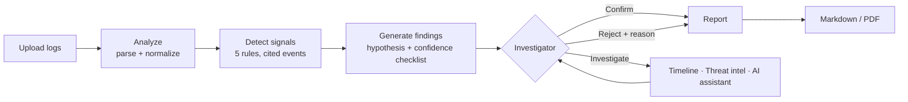
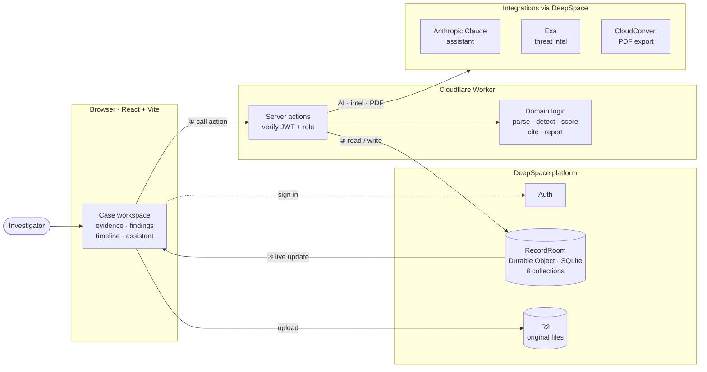

# FlowPilot

**A real-time, collaborative security investigation workspace: rule-based detection finds suspicious account activity in your logs, investigators confirm each finding, and an AI assistant explains what happened with every claim cited back to the exact log line.**

Built on [DeepSpace](https://docs.deep.space) (Cloudflare Workers + Durable Objects) with React, TypeScript, and Vite.

---

## Contents

- [Why FlowPilot](#why-flowpilot)
- [Features](#features)
- [How an investigation works](#how-an-investigation-works)
- [Architecture](#architecture)
- [DeepSpace integrations](#deepspace-integrations)
- [Data model](#data-model)
- [Server actions](#server-actions)
- [Trust & safety design](#trust--safety-design)
- [Failure handling](#failure-handling)
- [Getting started](#getting-started)
- [Testing](#testing)
- [Project structure](#project-structure)
- [Limitations & roadmap](#limitations--roadmap)

---

## Why FlowPilot

Most "AI security" tools paste raw logs into a chatbot and hope. FlowPilot inverts that:

1. **Deterministic code finds the facts.** A rule engine parses the logs and flags known attack patterns, recording the exact line behind every event.
2. **A human decides.** Every finding is a *suggestion* with an explainable confidence score until an investigator confirms or rejects it.
3. **The AI explains, it doesn't decide.** The model never reads raw files. It receives structured findings and must label every statement as **evidence** (cited to a source line) or **inference** (its interpretation). The server, not the model, enforces that contract.

---

## Features

### Case workflow
- Cases move through **Intake → Evidence → Analysis → Findings → Review → Exported**, shown as a progress tracker.
- Case numbers like `FP-7KQ2MX`, live-synced to everyone viewing the case.

### Evidence ingestion
- Upload **JSON arrays, JSON lines, CSV, or plain-text logs** (up to 200,000 characters each), or load a built-in sample.
- Column names are normalized automatically: `user` / `email` / `userPrincipalName` → **actor**; `operation` / `event` → **action**; and so on.
- Every file is fingerprinted with **SHA-256** for integrity, and the original is kept in file storage (R2).
- **View raw evidence** shows the file exactly as stored, with line numbers.

### Detection (rule engine)
| Rule | Pattern | Severity |
|---|---|---|
| Sign-in after failures | 3+ failed logins, then a success | High |
| Repeated failure | 8+ failures, never succeeded | Medium |
| Password spray | One IP failing against 4+ accounts | High |
| Privilege change | Role grant, admin assignment | High |
| Account control change | Mailbox rule, forwarding, MFA change, OAuth consent | High |

Each signal records the **exact events** (line numbers or JSON positions) that triggered it.

### Human-in-the-loop review
- Each finding is shown as a **Suggested finding** with a plain-language hypothesis (for example *"Possible credential compromise"*).
- **Confidence** comes from a transparent **evidence checklist**, not the AI's opinion:
  `✓ 3 failed logins +15 · ✓ successful login afterwards +15 · ✓ new IP address +15 · – admin rights afterwards · ✓ outside business hours +5`
- Checklist items can be corroborated **across files** (a login log plus an audit log), and each ✓ links to its source events.
- Decisions: **Confirm**, **Reject** (a reason is required), or **Investigate** (hold open, jump to the evidence, ask the assistant).
- Every decision is written to an **append-only audit trail**, including the confidence the reviewer was shown.

### Investigation timeline
- Every event from every file on **one UTC clock**, grouped by day, with plain-language labels (*Failed login*, *Admin role granted*, *Data exported*…).
- Flagged events are highlighted by severity; filter between **All** and **Flagged only**.
- Click an event to see its **raw source line with context**, file fingerprint, related signals and verdicts, and any AI statements that cite it.

### AI investigation assistant
- Ask questions like *"What happened in this investigation?"*
- Answers are split into **Evidence** (cited, e.g. `login.csv — lines 142–149`) and **Inference**, plus **Open questions**.
- Citations are clickable and jump to the event on the timeline.
- Answers are saved on the case and shared live with collaborators.
- Lives in a **side panel** that stays visible while you work (a slide-over drawer on small screens).

### Threat intel
- **Look up IPs on the web** for any finding. Results appear on the finding card, clearly labelled *external, unverified, not evidence*.
- Only IP addresses leave the app, never usernames or emails.

### Reporting
- **Export report** creates a Markdown report of the evidence, confirmed findings with their checklists and reviewer notes, and rejected findings with reasons.
- **Create PDF** produces a print-ready A4 PDF.
- Export is blocked until every finding is confirmed or rejected.

### Administration
- **Load demo cases**: 55 realistic fictional cases with 3–7 log files each. Safe to run repeatedly.
- **Delete case** (admins only, type-to-confirm) removes the case and everything on it.
- Roles: **viewer** (read-only), **member** (analyst), **admin**.

---

## How an investigation works



**Worked example:** Morgan reports an unexpected MFA prompt. The analyst uploads `sign-in-log.json`. Analysis flags *3 failed logins then a success from a new IP at 01:12 UTC*, followed 6 minutes later by a *Global Administrator grant*. The finding scores **90%** with each checklist item linked to its line. The analyst asks the assistant, which answers:

> **Evidence:** morgan@example.com failed to log in 3 times from 203.0.113.44, then succeeded. *(sign-in-log.json — events #1–4)*
> **Inference:** This pattern is consistent with a guessed password followed by privilege escalation.
> **Open question:** Is 203.0.113.44 a known VPN address?

The analyst confirms the finding and exports a PDF report.

---

## Architecture



**The request loop:** ① the browser calls a server action with the user's JWT; ② the action checks the role, runs the domain logic, and writes records; ③ the RecordRoom pushes the change over WebSocket to everyone viewing the case. Browsers never write records directly.

**Key decisions**

- **All writes go through server actions.** Every collection is read-only to clients, so the browser can only read (live) and call actions. Each action verifies identity and role before touching data.
- **Domain logic is pure TypeScript** (`src/investigation/`), with no I/O. The same analyzer runs on the server (analysis, findings, AI context) and in the browser (timeline, source excerpts), and is unit-tested without mocks.
- **Real-time by default.** Records live in a Durable Object. Every change is pushed over WebSocket, so collaborators see uploads, decisions, and AI answers instantly.
- **Deterministic before generative.** Parsing, detection, and scoring are rules. The LLM only summarizes structured, cited facts.

---

## DeepSpace integrations

FlowPilot uses **3 third-party integrations** through DeepSpace's integration proxy. No API keys live in the app.

| Integration | Used for | Where |
|---|---|---|
| **Anthropic (Claude, `claude-opus-5-5`)** | Investigation assistant: cited summaries split into evidence and inference | `askAssistant` via `createDeepSpaceAI(env, 'anthropic')` + Vercel AI SDK |
| **Exa** (`exa/search`) | Threat-intel web lookup for a finding's public IPs | `lookupIntel` via `tools.integration` |
| **CloudConvert** (`cloudconvert/convert-file`) | HTML → PDF report export | `createReportPdf` via `tools.integration` |

### DeepSpace platform features used

| Feature | How FlowPilot uses it |
|---|---|
| **Auth** | Sign-in, verified JWTs, app roles (viewer / member / admin) |
| **RecordRoom** (Durable Object + SQLite) | Persistent storage for all 8 collections, with live sync to clients |
| **Server actions** | The only write path: 11 role-checked actions |
| **R2 file storage** | Original uploaded evidence files (`useR2Files`) |
| **Schemas & RBAC** | Collection definitions in `src/schemas/`, all client-read-only |

---

## Data model

All collections live in one RecordRoom, linked by `caseId`.

| Collection | Holds | Written by |
|---|---|---|
| `cases` | Case number, title, summary, stage | `createCase`, workflow actions |
| `evidence` | File name, full text, SHA-256, analysis status, summary, signals, warnings | `addEvidence`, `analyzeEvidence` |
| `findings` | Hypothesis, severity, confidence, checklist (`factors`), status, latest decision | `generateFindings`, `reviewFinding` |
| `reviews` | Append-only decision history (decision, note, reviewer, confidence shown) | `reviewFinding` |
| `briefs` | AI answers: statements, citations, web sources, warnings | `askAssistant` |
| `intel` | Exa results per finding + IP | `lookupIntel` |
| `reports` | Markdown body, export time, PDF link + expiry | `exportReport`, `createReportPdf` |
| `users` | Name and role (DeepSpace-managed) | Platform |

Finding status: `draft` → `investigating` → `accepted` (confirmed) | `dismissed` (rejected).

---

## Server actions

Defined in [`src/actions/investigation.ts`](src/actions/investigation.ts), registered in [`src/actions/index.ts`](src/actions/index.ts), served at `POST /api/actions/:name`.

| Action | Role | Purpose |
|---|---|---|
| `createCase` | member, admin | Open a case |
| `addEvidence` | member, admin | Store a log file (rejects empty, binary, undecodable, oversized, duplicate) |
| `analyzeEvidence` | member, admin | Parse and detect signals; optional `evidenceId` retries one file |
| `generateFindings` | member, admin | Turn signals into scored, reviewable findings |
| `reviewFinding` | member, admin | Confirm / reject (with reason) / investigate, plus an audit record |
| `exportReport` | member, admin | Build the Markdown report (requires all findings decided) |
| `createReportPdf` | member, admin | Convert the report to PDF (CloudConvert) |
| `askAssistant` | member, admin | Cited AI answer (Anthropic) |
| `lookupIntel` | member, admin | Web lookup for a finding's IPs (Exa) |
| `seedDemoCases` | admin | Load 55 demo cases (idempotent) |
| `deleteCase` | admin | Delete a case and all its records (type-to-confirm) |

---

## Trust & safety design

| Concern | How it's handled |
|---|---|
| AI presenting guesses as facts | Every statement must be `evidence` or `inference`. The server drops citations to events that don't exist and downgrades uncited "evidence" to **Unsupported**. A banner warns when nothing in an answer is backed by a source line. |
| AI seeing too much | The model gets structured signals and cited events only, never raw files. At most 12 events per signal are shown; the rest are counted, not described. |
| Web results treated as proof | Exa results get separate `W1…` IDs and can only support inferences. A statement backed only by web results is downgraded. |
| Made-up confidence | Confidence = base + weighted checklist items computed from the logs, each linked to its source. |
| Rubber-stamping | Rejecting requires a reason. Export is blocked while anything is a draft or under investigation. Every decision is audited. |
| Privacy | Only IP addresses are sent to Exa (private ranges are skipped). Usernames and emails never leave the app. |
| Tampering | Evidence is SHA-256 fingerprinted. Clients cannot write records directly. |
| XSS via log content | Report HTML for the PDF is fully escaped. Web links are restricted to `http(s)`. |
| Destructive actions | Deleting a case is admin-only and requires typing the case number, checked on the server. |

---

## Failure handling

| Failure | Behavior |
|---|---|
| **Invalid file** (binary, compressed, wrong encoding) | Rejected at upload with a plain explanation |
| **Empty evidence** | Rejected: *"The file is empty."* |
| **Malformed JSON / log** | **Analysis failed** with the exact reason and position, e.g. *"trailing comma before ] (line 2, column 1)"*. **Retry** and **View raw evidence** (jumps to the bad line). Bad JSON lines are skipped with a warning while good lines are kept. |
| **AI unavailable** | Inline error with **Retry**; nothing is saved; the rest of the case keeps working |
| **AI unsupported conclusion** | Downgraded to Unsupported and flagged; malformed output gets one automatic repair attempt |
| **Duplicate evidence** | Rejected by SHA-256 (renaming doesn't bypass it), checked in the browser and on the server |
| **Analysis timeout** | The AI call is cancelled after 60 s. Runs stuck in "running" for 2+ minutes show **Analysis timed out** with Retry. The analyzer handles a 5,000-event worst case in milliseconds. |

---

## Getting started

### Prerequisites
- Node.js 22.15+ / 24 / 26, npm 11.6+
- A DeepSpace account

### Run locally
```bash
npm install
npx deepspace auth login     # once per machine
npm run dev                  # http://localhost:5173
```
Sign in, open **Cases**, and (as an admin) click **Load demo cases** to populate 55 sample investigations.

> Run **one** dev server at a time. Starting a second one stops the first.

### Deploy
```bash
git add -A && git commit -m "…"   # deploys record the commit
npm run deploy                     # → https://flowpilot.app.space
```
The deployed app has its own, empty database; load demo cases again there if needed.

---

## Testing

```bash
npm run test:unit     # Vitest unit + action tests
npm run type-check    # TypeScript
npm run lint          # ESLint
npm run validate      # type-check + unit tests
npm test              # DeepSpace Playwright suites (smoke, api, e2e)
```

**77 unit tests** cover:
- Parsing every supported format, and every failure mode
- Detection rules, source locations, and a performance guard
- Confidence scoring and cross-file corroboration
- The AI contract: invented citations, unsupported claims, timeouts, outages, malformed output (with a fake model)
- Timeline merging and source excerpts
- Threat-intel IP filtering, PDF HTML escaping
- **Server actions end to end** against an in-memory record store: duplicates, retries, stuck runs, analyzer crashes, AI outages, cascading delete

---

## Project structure

```
src/
├── actions/                 Server actions (the only write path)
│   ├── investigation.ts     All 11 actions
│   └── index.ts             Action registry
├── investigation/           Pure domain logic (no I/O), shared by server and browser
│   ├── analyze.ts           Parsers, normalization, detection rules, source excerpts
│   ├── json-error.ts        Pinpoints JSON syntax errors (line/column)
│   ├── assess.ts            Hypotheses + evidence-checklist confidence
│   ├── assistant.ts         AI context, prompt, citation enforcement, runAssistant
│   ├── timeline.ts          Cross-file timeline, action labels
│   ├── intel.ts             IP filtering + Exa result normalization
│   ├── evidence-state.ts    Analysis lifecycle / timeout detection
│   ├── report.ts            Markdown report
│   ├── report-html.ts       Print-ready HTML for PDF
│   ├── seed.ts              Deterministic demo data
│   └── types.ts             Shared types
├── components/investigation/
│   ├── CaseWorkspace.tsx    Case page layout (main column + assistant sidebar)
│   ├── EvidenceRow.tsx      File status, failures, retry, raw viewer
│   ├── FindingCard.tsx      Review card: confidence, checklist, intel, decisions
│   ├── TimelinePanel.tsx    Timeline + event detail
│   ├── AssistantPanel.tsx   AI assistant
│   └── DeleteCaseButton.tsx Admin delete with confirmation
├── schemas/                 Collection schemas + RBAC
├── pages/                   File-based routes (generouted)
├── integrations.ts          Integration configuration
└── server/                  Action, HTTP, and realtime routes
worker.ts                    Cloudflare Worker entry
```

---

## Limitations & roadmap

**Current limitations**
- Detection rules are fixed. They don't know your normal IPs, working hours, or travel patterns.
- No IP geolocation or reputation feed in the integration catalog; Exa web search is the substitute.
- Evidence text is stored inline in records (fine for operational volumes; very large logs would belong in R2 only).
- PDF links expire after ~24 hours (regenerate on demand).
- Deleting a case removes uploaded file copies only for files the deleting admin uploaded.

**Ideas**
- Impossible-travel and per-organization baselines (known IPs, business hours)
- Email or Slack alerts for high-confidence findings
- Analyst-editable detection rules
- Case assignment and SLA tracking
